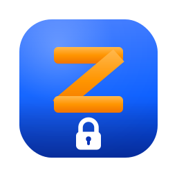
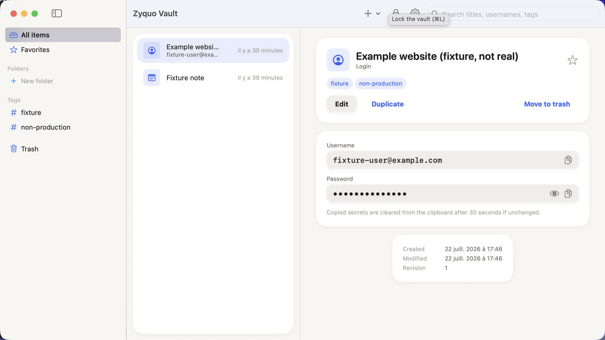
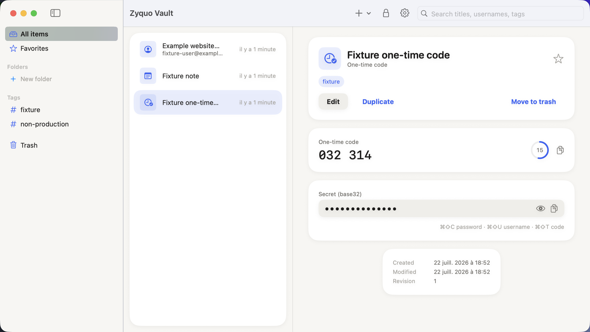
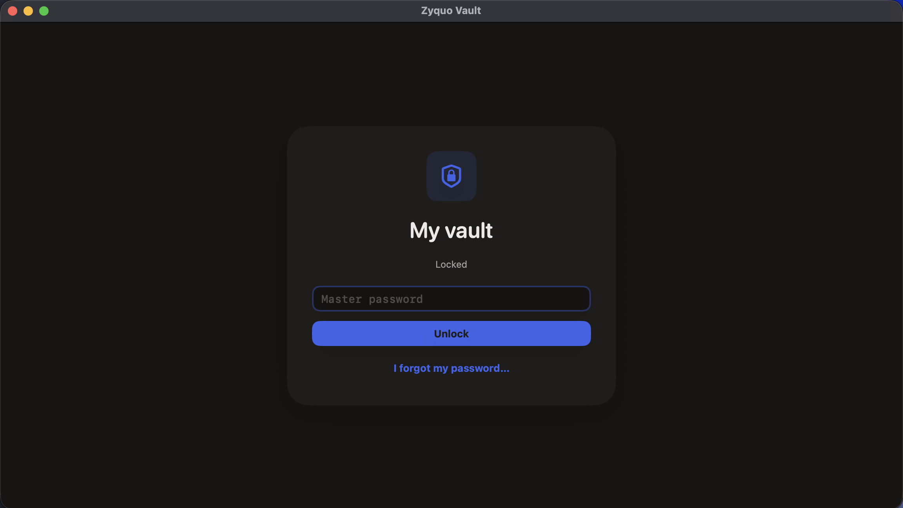

<div align="center">



# Zyquo Vault

**A local-first, fully offline, encrypted password manager for macOS.**
No cloud. No account. No telemetry. No Apple Keychain. Your master password is the only key.

[](https://github.com/simonpierreboucher-uqo/zyquo-vault/releases)
[](#building--terminal-only-no-xcode)
[](Package.swift)
[](https://github.com/simonpierreboucher-uqo/zyquo-vault/releases)

**[📖 User Manual](https://simonpierreboucher-uqo.github.io/zyquo-vault/)** · **[⬇️ Download](https://github.com/simonpierreboucher-uqo/zyquo-vault/releases/latest)**

[](#quality-metrics)
[](#quality-metrics)
[](#dependencies)
[-3563F5)](#design)
[](#performance)
[](#honest-status)

<br/>



<sub>Light is the reference theme · <a href="docs/screenshots/m8-lock-screen-dark.png">dark mode</a> is derived from the same design tokens</sub>

</div>

---

> [!WARNING]
> **Zyquo Vault is a feature-complete pre-release (v0.9.0) that has not yet undergone an independent security audit.** Until it has, do not use it as the *sole* storage location for irreplaceable production credentials. Every internal gate is green — the external audit is the one open item. See [`SECURITY.md`](SECURITY.md).

## Why Zyquo Vault

| | |
|---|---|
| 🔌 **Offline by construction** | The app has **no network entitlement at all** — the sandbox physically cannot open a socket. No sync, no accounts, no telemetry, ever. |
| 🔑 **One root of trust** | Your master password (plus an optional printed recovery key). No Apple Keychain, in any form — the vault is a self-contained, [byte-level documented format](docs/vault-format.md) an independent implementation could read. |
| 🧨 **Fails closed** | Every byte on disk is AES-256-GCM authenticated and bound to its identity (vault, object, type, revision). A flipped bit, a swapped file, a reordered attachment chunk, a rolled-back manifest — all detected, never silently accepted. |
| 💥 **Crash-safe** | Journalled multi-file transactions with an atomic commit point. Kill it mid-write and it rolls forward or back on next unlock — the last known valid state is never auto-discarded. *(Tested by simulating every interruption window.)* |
| 🫀 **Honest** | The [threat model](docs/threat-model.md) says what is **not** protected. Deletion honesty (SSD wear-leveling), Swift memory-erasure limits, and recovery consequences are stated in the UI, not buried in docs. |

## Features

- 🗂 **Nine item types** — logins, secure notes, API credentials, software licenses, payment cards, identities, SSH credentials, TOTP, generic secrets — with reorderable custom fields, tags, encrypted folders, favorites, and an encrypted trash
- 🔍 **Search** over an in-memory index built *only* from non-secret fields (URLs reduced to hostname, concealed values provably never indexed), discarded on lock
- 🎲 **Password generator** — random / passphrase (EFF wordlist) / PIN / pattern, CSPRNG with rejection sampling (bias-tested), entropy always labeled *estimate*
- ⏱ **TOTP** — RFC 6238 (SHA-1/256/512, 6/8 digits), validated against every RFC test vector, live countdown ring, `otpauth://` import
- 📋 **Clipboard hygiene** — countdown chip, clears only if the clipboard still holds *your* value, always cleared on lock, transient/concealed pasteboard hints
- 📎 **Encrypted attachments** — streamed 1 MiB authenticated chunks (never whole-file in memory), position-bound so chunks can't be reordered or transplanted
- 💾 **Backups that count** — daily automatic snapshots, *cryptographically verified before they're considered created*, retention (last 10 + daily×7 + weekly×4), restore into a separate vault only
- 🔁 **Import/export** — generic & browser CSV, Bitwarden JSON, encrypted `.zyquoexport` under its own password; plaintext export exists but only behind a typed confirmation
- 🌓 **Light & dark** from one token system, ⌨️ full keyboard shortcuts, 🦾 VoiceOver with concealed values never exposed until revealed
- 🖥 **CLI** — `zyquo-vault-cli vault info|verify|backup` (password via secure prompt or stdin, never as an argument)

<div align="center">
 
</div>

## Security model

```
master password ──Argon2id (per-vault salt, calibrated on-device)──▶ PKEK
recovery key ────HKDF──▶ recovery KEK ─────────────┐
                                                   ▼
PKEK ──authenticated unwrap──▶ VMK (random 256-bit, wrapped in the header)
VMK ──HKDF-SHA256, domain-separated──▶ record / attachment / manifest /
                                       backup / header-auth subkeys
subkeys ──wrap──▶ per-record & per-attachment random DEKs
DEKs ──AES-256-GCM + canonical AAD──▶ everything on disk
```

- **KDF:** Argon2id v19 — vendored [official reference implementation](https://github.com/P-H-C/phc-winner-argon2) (pinned commit, official KAT vectors in CI), enforced floors 64 MiB / t=3, DoS ceilings checked *before* allocation, calibrated to ~0.75 s per unlock on your machine
- **AEAD:** AES-256-GCM (CryptoKit, hardware-accelerated), fresh CSPRNG nonce per seal, 57-byte canonical AAD binding every ciphertext to `(vault, object, type, schema, revision)`
- **Password verification** *is* the authenticated unwrap — wrong password and corruption are deliberately indistinguishable
- **Memory:** a `VaultSession` actor is the only owner of key material; locking zeroes the VMK (`memset_s` + `mlock` best-effort), destroys decrypted temp files, clears the clipboard, and drops the search index — the lock screen appears *because the keys are gone*
- Full details: [`docs/cryptography.md`](docs/cryptography.md) · [`docs/vault-format.md`](docs/vault-format.md) · [`docs/threat-model.md`](docs/threat-model.md)

## Quality metrics

| Gate | Result |
|---|---|
| Unit / integration / UI tests | **107 passing** across 6 test bundles |
| Known-answer vectors | Argon2id (8 official) · HKDF RFC 5869 · TOTP RFC 6238 Appendix B (all 18) · HOTP RFC 4226 (all 10) · base32 RFC 4648 |
| Fuzzing (deterministic seeds) | **~2,600 iterations, 0 crashes** — header, manifest, record, attachment, export container, CSV, Bitwarden JSON, `otpauth://`, base32, recovery key |
| Crash-recovery simulations | put/delete × record/attachment, every interruption window, roll-forward & rollback |
| Tamper detection | GCM tag, AAD identity, stale-revision substitution, chunk reordering, manifest generation, backup digests — all rejected by test |
| CI audit scripts | `audit-forbidden-apis` (Keychain ban, `try!`/`fatalError` ban, secret-logging grep) · `audit-design-tokens` (no raw visual values in UI) · `audit-dependencies` |
| Accessibility | Automated WCAG AA contrast over both palettes; concealed fields hidden from assistive tech until revealed (tested) |

## Performance

Measured by `PerformanceTests` on Apple Silicon (regression ceilings asserted in CI):

| Operation | Time |
|---|---|
| Unlock — Argon2id (floor params) + header + manifest + journal scan | **0.14 s** *(production calibrates to ~0.75 s by design)* |
| Write 200 records (each journalled, 2× `F_FULLFSYNC`) | 3.0 s (~15 ms/record) |
| Build search index — decrypt all 200 records | **13 ms** |
| Deep integrity verification — 200 records | **7 ms** |

## Building — terminal only, no Xcode

Requires macOS 15+ and the Swift 6 toolchain — **Xcode Command Line Tools are sufficient** ([how that works](docs/build-without-xcode.md)).

```bash
./scripts/bootstrap.sh        # verify toolchain
./scripts/build.sh            # swift build -c release
./scripts/test.sh             # full suite (107 tests)
./scripts/package-app.sh      # → dist/Zyquo Vault.app (ad-hoc signed)
./scripts/run.sh              # build + package + open
./scripts/notarize.sh         # Developer ID sign + DMG + notarize + staple
```

Or just grab the **[signed & notarized DMG from the latest release](https://github.com/simonpierreboucher-uqo/zyquo-vault/releases)**.

## Dependencies

**Zero external Swift packages.** Apple frameworks (SwiftUI, CryptoKit, AppKit) plus one piece of vendored code: the official Argon2 reference implementation, pinned by commit and validated against its own test vectors ([ADR-0002](docs/decisions/ADR-0002-argon2-vendored-reference.md)). `SecRandomCopyBytes` is the only Security.framework symbol used — randomness, not Keychain.

## Design

The UI is built from a single token system — **"Zyquo Soft Light"** ([`docs/design-system.md`](docs/design-system.md)): warm off-white canvas, continuous-curvature corners everywhere, one accent (*Zyquo Blue*, tuned so white labels pass AA 4.5:1), soft diffuse elevation, and a gold reserved for the recovery-key ceremony. Dark mode is derived from the *same token names* and gated by the same automated contrast tests. A lint script fails CI if any raw hex, literal radius, or ad-hoc shadow appears in UI code.

## Milestones

- [x] **M0** Foundation — SwiftPM targets, token system, packaging, audits
- [x] **M1** Crypto core — Argon2id, HKDF, AES-GCM, VMK wrapping, tamper tests
- [x] **M2** Persistence — manifest, record envelopes, journal, locking
- [x] **M3** Session & lock — `VaultSession`, lock screen, recovery key, password change
- [x] **M4** Item UI — three-pane browser, editor, trash, folders, search
- [x] **M5** Security usability — generator, clipboard, TOTP, Markdown, settings
- [x] **M6** Attachments & backups — chunked AEAD, verified snapshots, restore
- [x] **M7** Import/export — CSV, Bitwarden, encrypted export, plaintext gate
- [x] **M8** Hardening — fuzzing, performance, dark mode, release
- [ ] **v1.0** Independent security audit

## Honest status

- 🔍 **Not yet independently audited** — the format and crypto docs are written specifically to make that audit possible
- 🔐 **Forgotten master password = permanent loss** unless you opted into a recovery key. No security questions, no email reset, no backdoor
- 👆 **Touch ID cannot survive a restart** without the Keychain — Zyquo will only ever offer biometric re-authorization of an already-unlocked session
- 🧠 Swift cannot guarantee perfect memory erasure; `SecureBytes` is best-effort and documented as such
- 💽 Deleting data on SSDs is not physically guaranteed — encryption + key destruction is the real control

## Documentation

**[📖 The complete user manual](https://simonpierreboucher-uqo.github.io/zyquo-vault/)** — installation, vault creation, recovery keys, every feature with screenshots, keyboard shortcuts, CLI, FAQ.

[`architecture`](docs/architecture.md) · [`cryptography`](docs/cryptography.md) · [`vault-format`](docs/vault-format.md) · [`threat-model`](docs/threat-model.md) · [`design-system`](docs/design-system.md) · [`build-without-xcode`](docs/build-without-xcode.md) · [`recovery`](docs/recovery.md) · [`migrations`](docs/migrations.md) · [`audit checklist`](docs/security-audit-checklist.md) · [`ADRs`](docs/decisions/)

## Reporting security issues

See [`SECURITY.md`](SECURITY.md) — please don't open public issues for suspected vulnerabilities.

---

<div align="center">
<sub>© 2026 Simon-Pierre Boucher · Built entirely from the terminal · <a href="LICENSE">License</a></sub>
</div>
